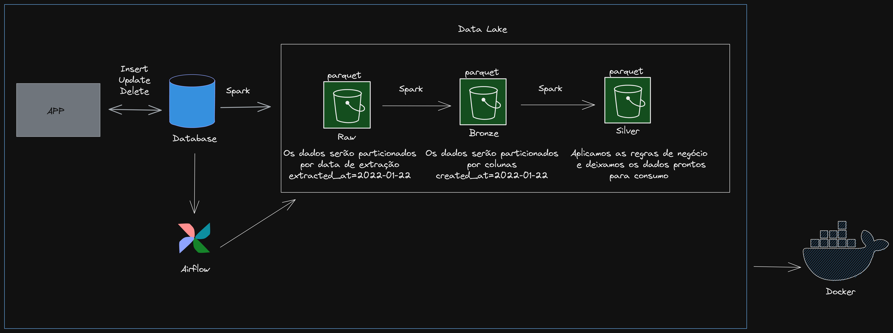
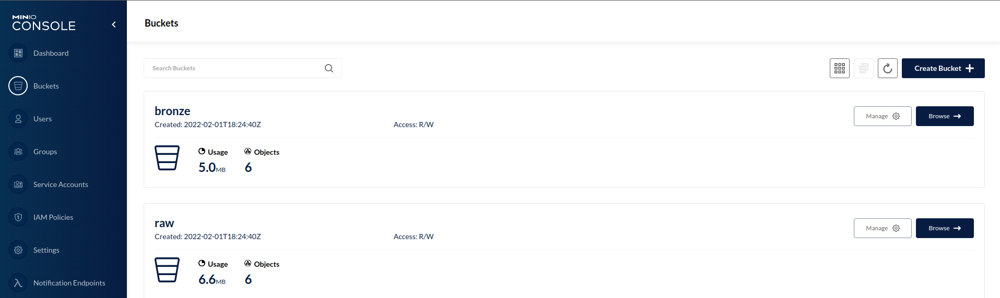

# Case Técnico - [Gamers Club](https://gamersclub.gg/)

<br></br>
**Desafio:** Criar um ambiente mínimo local para realizar a ingestão dos dados fornecidos.
- Ingestão das tabelas na camada raw
- Padronização das tabelas e colunas na camada bronze.
<br></br>

## 🎯 Fluxo do projeto

<p align="center">
  
</p>

<br></br>

## 🎨 Layout

<p align="center">
  
</p>

<br></br>

## ⚙️ Passo a passo para reproduzir o projeto
#### Instalação do docker:
[Linux](https://www.digitalocean.com/community/tutorials/how-to-install-and-use-docker-on-ubuntu-20-04-pt) -
[Windows](https://docs.docker.com/desktop/windows/install/)
#### Instalação do poetry (windows / linux):
[poetry](https://python-poetry.org/docs/)

#### Configurando o ambiente:
```bash
# Faça download dos arquivos no link
$ git clone https://github.com/karinnecristina/Case_gamers_club
```

```bash
# Ative o ambiente virtual
$ poetry env use python3
```
```bash
# Instale as dependências
$ poetry install
```
#### Rodando a aplicação utilizando o airflow:

```bash
# Na pasta do projeto inicie o airflow
$ docker-compose up airflow-init
```
```bash
# Execute a aplicação
$ docker-compose up
```
#### Rodando a aplicação manualmente:

```bash
$ poetry run python pipeline.py
```

<br></br> 

## 🛠 Ferramentas e Tecnologias utilizadas

- [Python](https://www.python.org/) - Linguagem de programação
- [Poetry](https://python-poetry.org/) - Gerenciamento de ambientes virtuais
- [Postgres](https://www.postgresql.org/) – Banco de dados
- [Apache Airflow](https://airflow.apache.org/) – Automatizar o pipeline
- [Minio](https://min.io/) – Data Lake
- [Docker](https://www.docker.com/) – Executar toda aplicação
- [Git](https://git-scm.com/) – Versionamento dos códigos

<br></br>

### 💪 Como contribuir para o projeto
---

1. Faça um **fork** do projeto.
2. Crie uma nova branch com as suas alterações: `git checkout -b my-feature`
3. Salve as alterações e crie uma mensagem de commit contando o que você fez: `git commit -m "feature: My new feature"`
4. Envie as suas alterações: `git push origin my-feature`

<br></br>

### Autor (a)
---

Feito com ❤️ por Karinne Cristina 👋🏽 Entre em contato!

[](https://www.linkedin.com/in/karinnecristinapereira/) 
[](mailto:karinnecristinapereira@gmail.com)

<br></br>

### 📝 Licença
---

Este projeto esta sobe a licença [MIT](./LICENSE).
